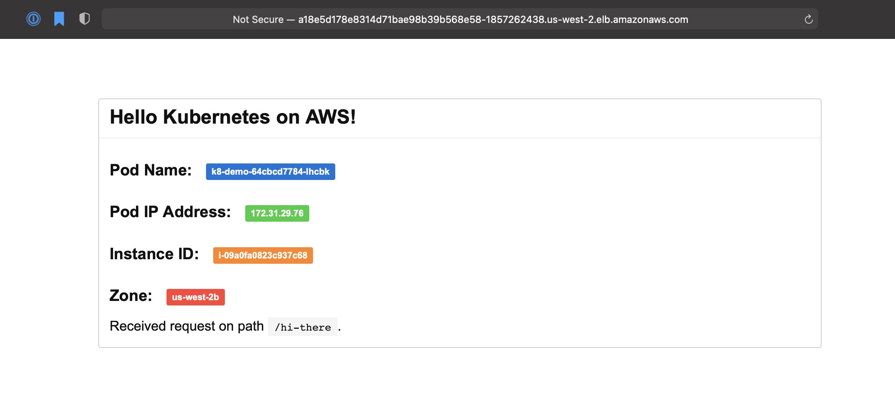

# K8s Demo App

Simple web application that displays a simple message and information about Pod, EKS Cluster, AWS Node and Zone serving the request.

The application is also published as a container image [quay.io/stepanstipl/k8s-demo-app][1]

Note: This app is based off the following repo, originally written for GCP: https://github.com/stepanstipl/k8s-demo-app

[1]: https://quay.io/repository/stepanstipl/k8s-demo-app

## Deployment

See `deploy.yaml` for simple deployment example.

The application exposes health-check `/healthz` endpoint.

## Configuration

Serving port (defaults to `8080`) can be parametrised using the `-listen-addr` flag or `K8S_DEMO_APP_LISTEN_ADDR` environment variable.

Displayed message can be parametrised by setting the `K8S_DEMO_APP_MESSAGE` variable.
kubectl apply -f https://k8s.io/examples/pods/inject/dapi-envars-pod.yaml
